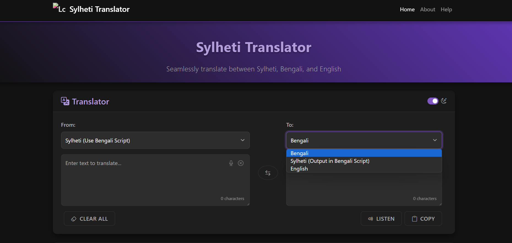
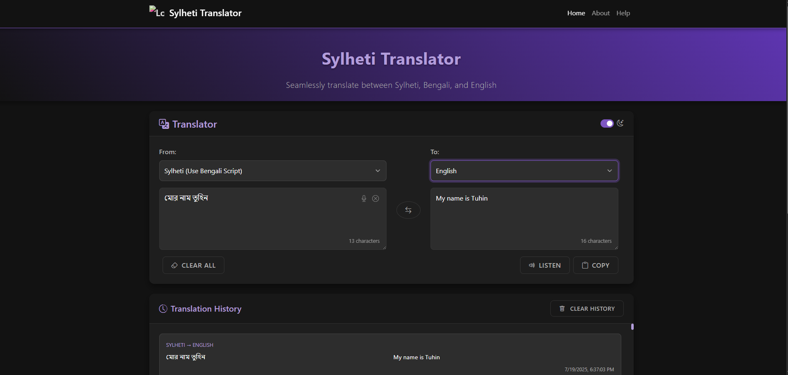

# Sylheti Translator Backend

This is a backend service for Sylheti language translation and speech recognition, built with Flask.

## Features

- Sylheti text and speech translation
- Audio file processing and recognition
- RESTful API endpoints
- Database integration with SQLAlchemy
- Easy extensibility for new features

## Screenshots

| Home Page | Translation Feature |
|-----------|--------------------|
|  |  |


## Getting Started

### Prerequisites

- Python 3.8+
- pip (Python package manager)

### Installation

1. **Clone the repository:**
   ```sh
   git clone <your-repo-url>
   cd sylheti_translator_backend
   ```

2. **Install dependencies:**
   ```sh
   pip install -r requirements.txt
   ```

3. **(Optional) Set up environment variables:**
   - Create a `.env` file in the root directory if needed (for database URLs, secret keys, etc.).

4. **Run the application:**
   ```sh
   python app.py
   ```
   The app will be available at [http://127.0.0.1:5000/](http://127.0.0.1:5000/).

## Project Structure

```
sylheti_translator_backend/
│
├── app.py
├── config.py
├── requirements.txt
├── routes.py
├── models/
├── scripts/
├── data/
├── static/
├── templates/
├── assets/           # <-- Place your screenshots here
└── ...
```


## License

[MIT](LICENSE) (or your chosen license)

---

**Note:**  
- Replace `<your-repo-url>` with your actual repository URL.  
- Update the screenshot filenames as needed.  
- Add more sections (API usage, contributing, etc.) if required.